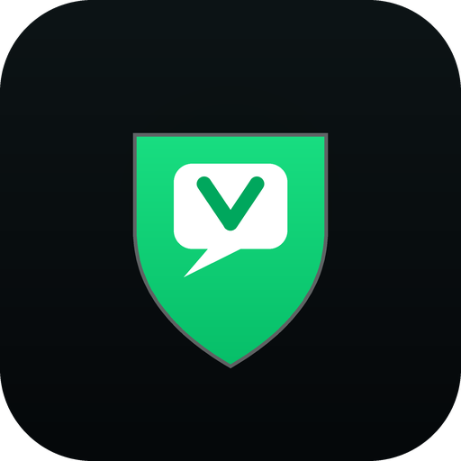

# 🛡️ VirtualMax — Приватный клиент-песочница для мессенджера МАКС

  
   
  <b>Защищенный кроссплатформенный клиент для мессенджера МАКС (web.max.ru) с нулевым сбором данных</b>
   
  <i>Блокировка телеметрии VK/Яндекс • Режим Невидимки • Управление датчиками • Android • Windows • Linux • macOS</i>

  
  
  
  
  

---

## 🔒 Ключевые возможности

1. **🛡️ Сетевая и аппаратная защита (Zero-Telemetry)**:
   - Полное уничтожение всех запросов к трекерам `VK / Mail.ru`, **Яндекс Метрике**, **WebVisor**, **Sentry** и **AppMetrica**.
   - Блокировка внутренних эндпоинтов метрик.
   - Защита от утечки IP-адреса через WebRTC.
   - Нейтрализация фоновых маяков `navigator.sendBeacon()`.

2. **🎛️ Аппаратные переключатели разрешений**:
   - 🎙️ **Микрофон** — голосовые сообщения и звонки.
   - 📷 **Камера** — видеозвонки и фото.
   - 🔔 **Уведомления** — push-уведомления.
   - 👻 **Режим Невидимки** — скрытие статуса «Печатает...».

3. **🔗 Защита внешних ссылок**:
   - Автоматическое удаление трекинг-меток (`utm_*`, `yclid`, `fbclid` и др.).

4. **🔍 Масштабирование и Режим ПК**:
   - Регулировка шрифта (70-160%) и переключение мобильный/десктоп.

5. **📥 Менеджер загрузок**:
   - Сохранение медиа в папку «Загрузки».

6. **🧹 Экстренная очистка**:
   - Удаление cookies, LocalStorage и кэша в один клик.

---

## 📦 Скачать

| Платформа | Файл |
|-----------|------|
| Android | `VirtualMax.apk` |
| Windows | `.exe` (установщик), `.exe` (portable) |
| Linux | `.AppImage`, `.deb` |
| macOS | `.dmg`, `.zip` |

Готовые релизы: [Releases](https://github.com/aiexpr/Virtual-Max/releases)

---

## 🔨 Сборка из исходников

### Android
\`\`\`bash
cd mobile
chmod +x build.sh
./build.sh
\`\`\`

### Desktop (Windows, Linux, macOS)
\`\`\`bash
cd desktop
npm install
npm run build:win    # Windows
npm run build:linux  # Linux
npm run build:mac    # macOS
\`\`\`

---

## ⚖️ Лицензия

Проект распространяется под **GNU Affero General Public License v3.0 (AGPL-3.0)**.

**Отказ от ответственности:** VirtualMax — независимый проект с открытым исходным кодом, созданный в исследовательских целях. Не аффилирован с VK или платформой МАКС.

---

## 📂 Структура

\`\`\`
VirtualMax/
├── mobile/          # Android (Java, WebView)
│   ├── app/        # Код и ресурсы
│   └── build.sh    # Скрипт сборки APK
├── desktop/        # Electron (Windows, Linux, macOS)
│   ├── src/        # Исходный код
│   └── assets/     # Иконки
└── releases/       # Готовые сборки
\`\`\`
